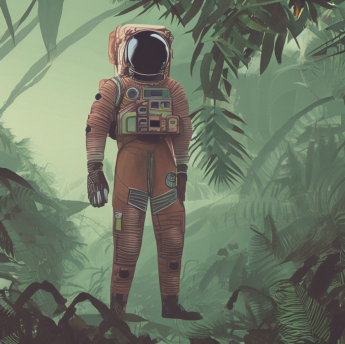

## Image Quality 

As you can see from this direct comparison that both models are capable of generating amazing images the picture on the left which is from Stable Diffusion and you ca straight away see that the model is going for making the image more realistic by adding reflections and shadows based on the light. On the other side Dall-e2 went for more artistic result with warmer colors and more contrast in the colors.

When it comes to the textures and details both images have details, however Stable Diffusion does the task a bit better thanks to the lighting which highlights even the smallest of details in the texture of the orange 

 

When it comes to the second row of images (again the left one is Stable Diffusion and the right one is Dall-e2) the thing come the other way around this time Dall-e2 has generated an amazing compared to Stable Diffusion. The attention to detail and the amount of object is astonishing. Once again Dall-e2 has used more vibrant and rich in contract colors. On the other side Stable Diffusion used more muted and realistic colors again trying to make the image realistic as possible but here we can see that this models lacks the attention to detail for example the start of the bridge the pliers making the main structure for the road are blurry and not straight up also the water before and after the bridge are different shades of blue. 

 

Finally here is a comparison that solidified my choice. The left image from Stable Diffusion really well picks up the scene of an Astronaut in the jungle the use of muted colors is one more time really well sorted and the details in the astronaut are on point with the details of his costume and the surrounding jungle. However look at Dall-e's generated image it looks like a scene out of video game or a sci-fi movie.The attention to detail and lighting is amazing. The shadows and the scenery of that image are on another level. The details of the astronaut suit and the elements of the jungle makes the image really realistic 

 

