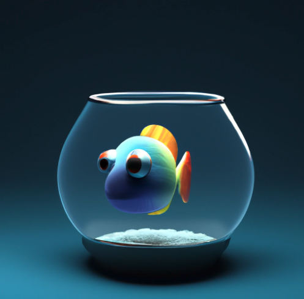
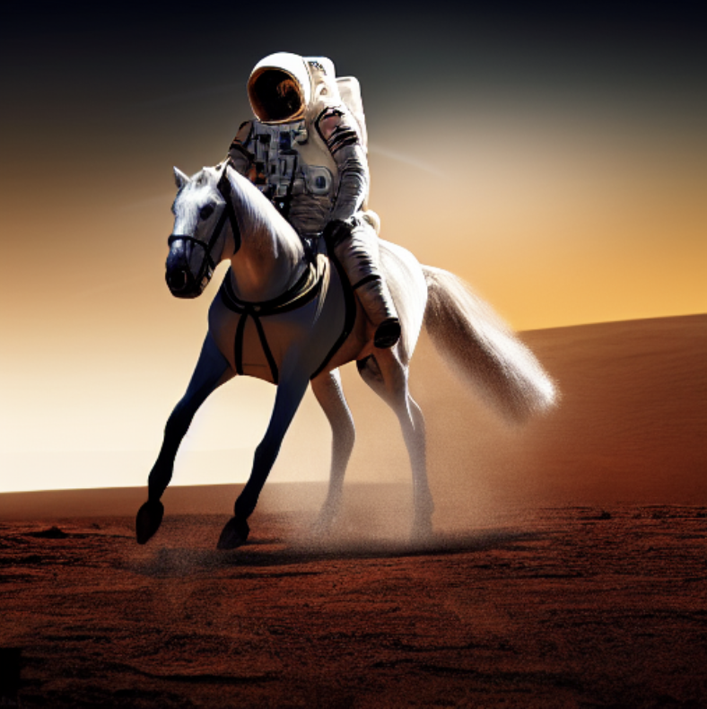
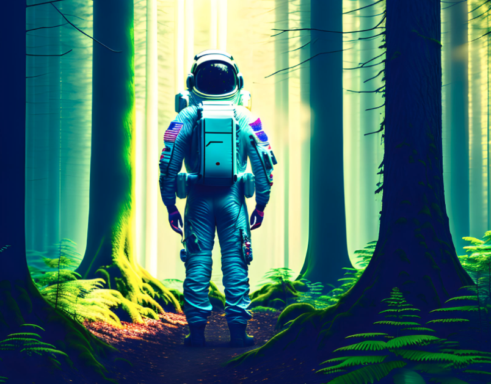
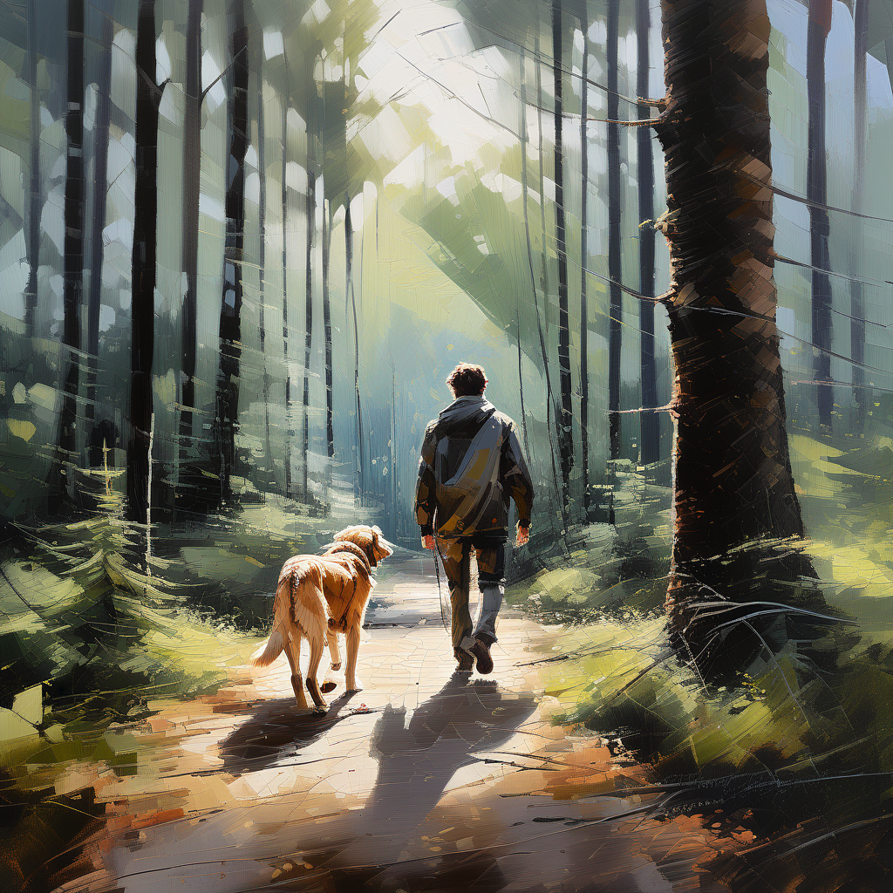
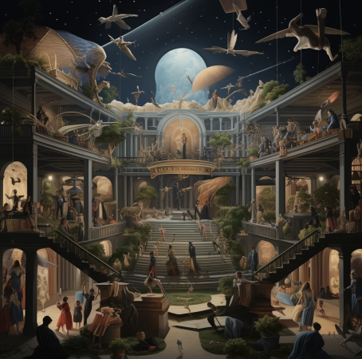
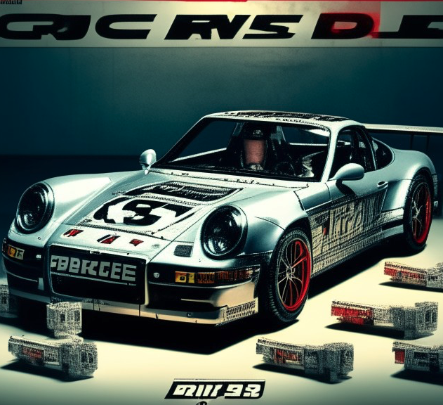
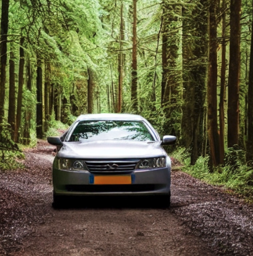

I have chosen this research approach to address the two sub-research questions and find an AI model that would work for the purpose of my project. My ability to research this field of AI technology has greatly benefited from using Competitive analysis method. I was able to get more knowledge about various tools and put them to immediate use in the setting. This experience has expanded my perspective even further, and I now know practical information about how to use these kinds of technologies. Above all, it has made it easier for me to understand what makes a Text-to-Image (TTI) AI model effective. It also gave me a strong basis for choosing which two AI models to use in the A/B testing.

## Comparison 

1. ## Dall-E2
     Developed by OpenAI, DALL-E2 is a cutting-edge AI model capable of generating detailed images from textual descriptions.

    

2. ## Stable Diffusion
    Stable Diffusion is an AI model designed for text-to-image generation, known for its efficiency and effectiveness in creating high-quality images.

    

3. ## Google DeepDream
    A program created by Google that uses a convolutional neural network to find and enhance patterns in images via algorithmic pareidolia.

    

4. ## RunwayMl 
    A collaborative web-based tool that offers various machine learning models, including text-to-image capabilities.

    

5. ## MidJourney
    MidJourney is an independent research lab exploring new mediums of thought and expanding the imaginative powers of the human species.

    

6. ## Artbreeder
     Artbreeder uses AI to combine and morph images, allowing users to create hybrids and variations of existing images or generated art.

     

7. ## DeepArt

    Focused on turning photos into artworks based on various famous styles, DeepArt uses a neural network to reimagine images in the style of famous artists.

    

## [More information](../Research%20Report/1st%20Research%20Phase/Competitive%20analysis.md)