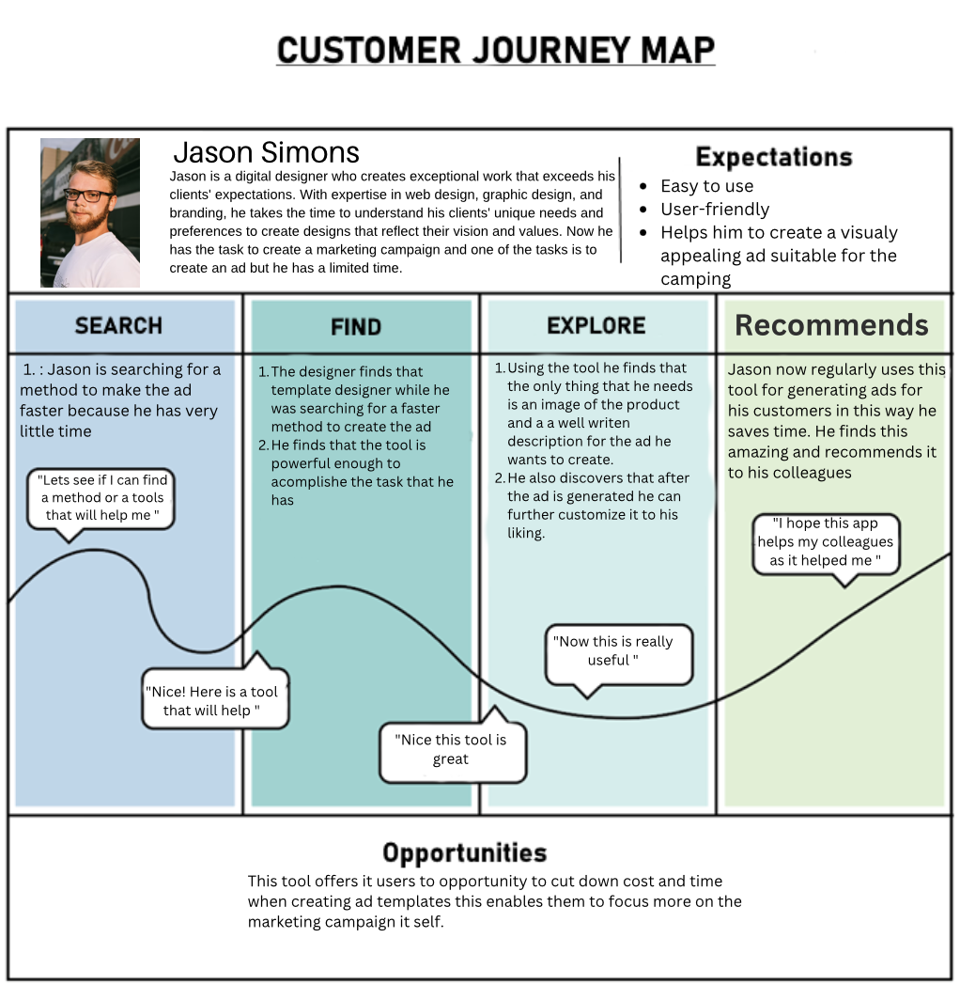

# Customer Journey

To get a real feel for how people would interact with the feature, I put together a [Customer journey map](https://www.canva.com/design/DAFNVcQY3x0/y5om5CvnM64ThbUamJNt_Q/edit?utm_content=DAFNVcQY3x0&utm_campaign=designshare&utm_medium=link2&utm_source=sharebutton). This was a visual story of a user's path of before and after finding the tool, showing me their potential actions and thoughts at each point in the process. The clues I gathered from this map were from a great interest. It turns out, users would really appreciate being able to whip up templates in no time it would give them a boost in productivity. This means they can focus more on the actual marketing campaigns rather than getting bogged down in design details.
The map revealed that users are eager for solutions that simplify their work life. The prospect of swiftly moving through the template creation phase meant they could invest more energy and time into strategizing and executing marketing initiatives, which is where their true passion lies. They are looking for an intuitive process that minimized the hassle of dealing with intricate design processes, thereby reducing frustration and freeing up creative headspace. This shift away from the nuts and bolts of design towards the broader canvas of marketing strategy could lead to richer, more impactful campaign ideas and leave more space for creativity.

The research journey has been quite enlightening. Understanding that users are looking for tools that save time and let them dive deeper into their creative marketing strategies has been a valuable discovery. It's rewarding to know that by speeding up the template creation process, we're not just improving an app feature we're helping users free up their creative energies for their marketing efforts. It feels good to work on something that'll make a user's task smoother and let them channel their time and thoughts into where it matters most: their marketing campaigns.

If you want to learn more about the process and insight form the customer journey you can go to the research document 

## [More information](../Research%20Report/1st%20Research%20Phase/Customer%20Journey.md)
##

