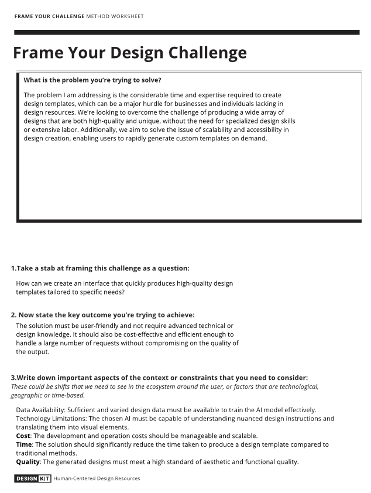

# Research framing 

In the initial stages of my research, I made the decision to employ the CMD research methodology, starting with the [Research Framing template](https://www.canva.com/design/DAFlcQdhC1o/bjwIYtQEf_tBr1e_Ttx4Ew/edit?utm_content=DAFlcQdhC1o&utm_campaign=designshare&utm_medium=link2&utm_source=sharebutton). This decision was influenced by the comprehensive nature of the template, which was an effective method for framing the objectives, challenges, and critical factors at the start of my investigation. This foundational step was crucial as it laid out a clear roadmap for the entire research and development phase. By methodically addressing specific questions, I was able to gain a broad understanding of the direction I needed to pursue and the necessary actions to undertake.
#
The template served as a robust structure for my research. Its structured nature provided a view from different perspectives of the problem, prompting me to examine various scenarios  and consider a wide range of influencing factors. It offered a systematic way to pinpoint and tackle the main issues, thereby clarifying the complexity of the challenge I faced.

Engaging with the thought-provoking queries of the template was particularly instrumental. It pushed me to dive deeper into the issue, fostering the development of potential research methodologies. This process was vital for developing my critical thinking skills, ensuring that I comprehensively evaluated all relevant aspects and variables. The template was not just a guide but a filter for intellectual exploration, laying a solid groundwork for the expansion and deepening of our research.

The template's application in the initial phase paved the way for a methodical, informed approach to the problem. It transcended mere understanding, empowering me to challenge preconceived notions and investigate innovative solutions with a holistic view. This approach not only bolstered my confidence in navigating the research but also significantly influenced our subsequent strategies, steering them towards a more deliberate and knowledge-driven path.

### More information
[Back to the research document-Research framing template](../Research%20Report/1st%20Research%20Phase/Research%20framing.md)
#

