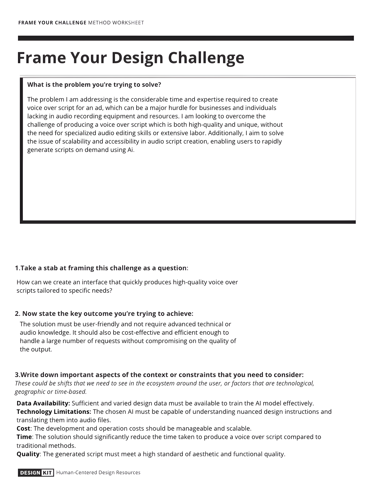

After the new assignment was given to me I oppeted one more time to utalize the 
[Research Template](https://www.canva.com/design/DAF2NU9TvCs/YLVh-05dJ8RcyKrmcDq64Q/edit?utm_content=DAF2NU9TvCs&utm_campaign=designshare&utm_medium=link2&utm_source=sharebutton). This decision was influenced by the previous time I used a template, which helped me understand the assignment and the goals I had to meet for the internship, so I decided to use it again for this project. I was able to comprehend that by responding to the template's questions once more and understand that the  ultimate research goal was to simplify generating voice-over scripts using AI, making it accessible and efficient, especially for those lacking audio recording resources. This was framed as creating a user-friendly interface for rapidly producing tailored, high-quality voice-over scripts. The solution involved integrating an AI-driven, fine-tunable text-to-speech model with an intuitive user interface, aiming for accessibility without requiring advanced technical skills and handling high-volume requests cost-effectively.

## [More information](../Research%20Report/2nd%20Research%20Phase/Research%20framing.md)
##
