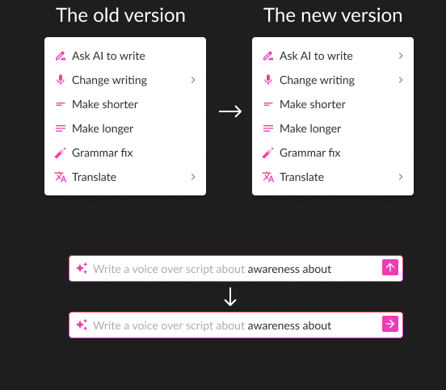

## Introduction 

After completing the development phase of the Voice Over Generator, which was my initial assignment, it was imperative to conduct thorough testing. This step was crucial to uncover any potential weaknesses or flaws in both the design and functionality of the tool.
The testing phase is a vital component of any development process, as it allows for a practical evaluation of the product in scenarios that mimic real-world usage. This approach helps in identifying issues that might not be evident during the development stage. For the Voice Over Generator, the focus was not only on ensuring that the tool functioned as intended but also on evaluating its user interface and overall user experience.
Testing provided an opportunity to gather insights on how intuitive and user-friendly the tool was, and whether it met the expected standards in terms of design and ease of use. It also allowed for assessing the effectiveness of the voice-over generation process itself – the core functionality of the tool. By identifying and addressing any issues in this phase, the aim was to refine the tool to a state where it would be robust, reliable, and well-received by its eventual users.
This step was essential in ensuring that the final product delivered on its promise and met the high standards set by the project requirements. Through rigorous testing, any shortcomings in design or functionality could be rectified before the tool's actual deployment, thereby enhancing its quality and effectiveness.

## Goal 

The objective of the testing phase for the project was to meticulously pinpoint any weaknesses in both the overall functionality and the design experience of the product. This phase was critical in the development process as it served as a key step in ensuring that the final product not only works as intended but also provides a seamless and user-friendly experience.
In this stage, the focus was on thoroughly examining every aspect of the product's performance and user interaction. The goal was to uncover any issues or challenges that might hinder the effectiveness or appeal of the product. This could include technical glitches, user interface problems, or any aspect of the design that could potentially confuse or frustrate users.
Identifying these weaknesses was essential for refining the product. It allowed  my mentor and designers to show me where i have to make the necessary adjustments and improvements, ensuring that the final version is not just functional but also intuitive and engaging for users. This testing phase was not merely about finding faults, it was an opportunity to understand the product from the user's perspective and to enhance it in ways that truly matter to the end-user.
By rigorously testing for weaknesses in both functionality and design, the aim was to produce a product that excels in performance and provides an exceptional user experience. This meticulous approach to testing underscores the commitment to quality and user satisfaction in the development process.

## Methodology

Similar to the previous test phase, the process was the same. Initially, I submitted a fully functional product that achieved its intended tasks. This was then reviewed by a designer and my mentor, who assessed the tool's functionality, user experience, and code structure. Once they completed their evaluation, I addressed any identified issues. The revised version was then distributed to a group of anonymous users for further evaluation of its performance and user experience. Following their feedback, I made additional refinements to the product before releasing it to the public.

## Feedback form the designers 

The feedback received from the testing group was generally positive, particularly regarding the functionality of the tool. They were satisfied with its ability to generate text based on the prompts entered in the input field, and the options to adjust the text length were functioning smoothly without any bugs. This positive response was encouraging as it affirmed the technical efficiency of the tool.
However, there were some minor points of feedback related to the user interface (UI). One issue noted was the misalignment of the dropdown menu under the “Magic icon,” which serves as the menu opener. Additionally, the “Ask AI to write” option was missing a left arrow “>”, a small but important detail that encourages user interaction by indicating hidden functionality.
Another suggestion from the feedback was to enable the Enter key as a trigger for generating audio. This would enhance user convenience, making the tool more intuitive to use. They also pointed out that when there is no text in the input field, all of the assistant’s options should be disabled to visually indicate their inactivity. To further improve user understanding, my mentor recommended adding a tooltip that appears only when the options are disabled, providing clear guidance that text input is required to activate these options.
Regarding the text generation input field, there was feedback that the “generate text” button’s arrow should point to the left instead of upwards. This was acknowledged by the designer as an oversight, as the upward direction was mistakenly included in the prototype. Additionally, there was a suggestion to modify the input field so that it wraps around the written text, ensuring that the text remains visible to the user.
This feedback was invaluable in highlighting areas for improvement, particularly in enhancing the UI to make it more user-friendly and intuitive. Addressing these points would not only refine the tool's design but also improve the overall user experience, making the tool more efficient and enjoyable to use.

## Feedback implementation 

Once all the feedback was collected, the next step was to incorporate these insights into the tool, preparing it for user testing. I began by tackling the simpler and more straightforward fixes. This included adding the missing arrows to the “Ask AI to generate” option and the submit button in the input field. Such minor adjustments, while seemingly small, play a significant role in enhancing the user's interaction with the tool.

Next, I focused on aligning the dropdown menu directly below the “Magic button.” This alignment is crucial for intuitive navigation and maintaining a clean, organized UI. Additionally, I addressed the functionality where all features, except for the text generation option, are disabled when no text is entered in the input field. To make this more user-friendly, I also added tooltips for the disabled options. These tooltips provide users with clear guidance on why these options are inactive, enhancing the tool's usability.
Another important modification was in the text generation input field. I enabled text generation with the press of the Enter key, an improvement that significantly streamlines the user experience. Also, I adjusted the input field to wrap around the text, ensuring that the entire input is visible and easily accessible to the user.
These modifications, based on the feedback received, were crucial in refining the tool's functionality and user interface. My focus was on making the tool not only functionally robust but also intuitive and user-centric, anticipating the needs and preferences of the end-users. This phase of implementation was essential in preparing the tool for the next round of user testing, where its performance and usability could be evaluated in real-world scenarios.

### [Assistant's results](https://www.canva.com/design/DAF5ZU4UtgM/NYcc9Awae4QopVZuPSpPEA/edit?utm_content=DAF5ZU4UtgM&utm_campaign=designshare&utm_medium=link2&utm_source=sharebutton)

