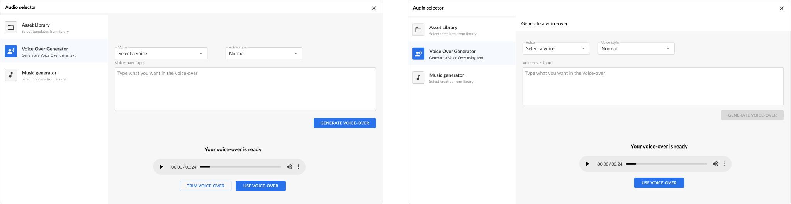
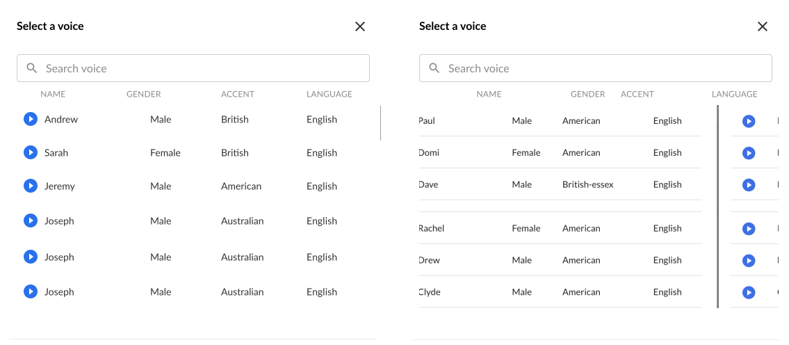
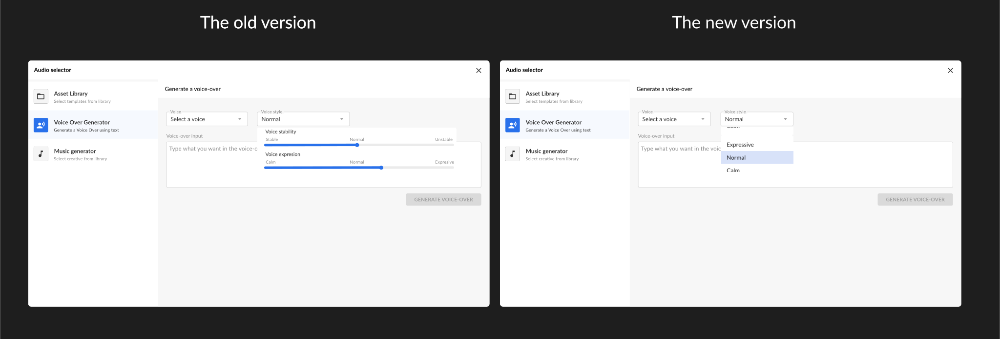

## Introduction

Testing is a critical step in product development across all industries. It offers a unique perspective on the product under development, particularly in terms of its performance and user experience. I selected this method for its ability to deepen my understanding of the users of the Campaign Designer platform, specifically regarding their needs and pain points.

This approach allowed for a comprehensive evaluation of the product from various angles, enabling me to identify and understand its potential weaknesses before it is deployed for actual use. By engaging in this method, I can observe how the product functions in different scenarios, how users interact with it, and how it meets, or fails to meet, their expectations.

This process is not just about finding flaws but also about gaining insights into user behavior and preferences. It provides a valuable opportunity to make necessary adjustments and improvements, ensuring that the product is well-tuned to user requirements and is ready for successful real-world application. The testing phase is, therefore, a vital component of the development process, ensuring that the final product is not only technically sound but also user-centric and effective in meeting its intended purpose.

## Goal 

The primary aim of this testing phase was to gauge user preferences and expectations for a new type of tool being introduced on the Campaign Designer platform, which was a first of its kind. Understanding user needs was crucial, especially considering the novelty of this tool. Additionally, a key aspect of the testing was to evaluate the tool's performance. One of the main objectives of the assignment was to provide users with a quicker and easier method for creating voice-over audio files, and it was essential to verify if this goal was being met effectively.

Another significant aspect of the testing was to assess the user experience. It was vital to determine if the tool's menus and interface were intuitive and user-friendly. The overarching goal for the interface design was to make it so straightforward and self-explanatory that users could navigate it with ease, ideally without needing an extensive onboarding process. This approach was in line with Cape's broader objective to minimize the time users spend learning how to use their platform, thereby enhancing overall efficiency and user satisfaction.

The testing phase, therefore, was not just about technical performance but also about user interaction and ease of use. It was about ensuring that the tool not only functioned efficiently but also resonated well with the users in terms of accessibility and usability. By focusing on these aspects, the goal was to refine the tool in a way that it aligns perfectly with user needs and Cape’s vision of providing a seamless user experience.
## Methodology 

My approach of testing involved collaboration with Cape's design team my mentor and a select group of small, anonymous users drawn from their most valuable customers. This strategy is crucial in product development, as it provides insights from both the design perspective and the user's viewpoint. This dual approach ensures comprehensive evaluation of the tool's functionality and design, leaving no stone unturned.

The testing process with the designers and my mentor was efficiently conducted. It entailed providing one of the design team members access to the feature I was working on and then gathering their feedback. This feedback was meticulously documented in a Jira ticket, a centralized repository for all information related to the development of new features. Once I had reviewed and assimilated this feedback, I made the necessary modifications to the tool.

The next step was to grant access to the select testing group of users. This allowed them to test the feature and offer their own observations and comments. Their feedback was crucial in identifying and resolving any remaining issues. After addressing these feedback points and making the final adjustments, the tool was ready for actual deployment.

By undergoing this rigorous testing process, Cape ensured that the new feature was thoroughly refined. Any potential issues or drawbacks were addressed, ensuring the feature was polished and fully prepared for user engagement. This methodical approach to testing and refinement was pivotal in delivering a quality product that meets the needs and expectations of its users.

## Feedback from the designers

After completing the functionality of the tool, ensuring the AI model was operational, and aligning the design with the prototype, my next step was to grant access to one of the designers and my mentor for testing. This was a crucial phase to evaluate the effectiveness and usability of the feature.

A few hours post-access, I received feedback from them and promptly organized a meeting to discuss their observations in detail. This discussion was aimed at gaining a clear understanding of their feedback and addressing any concerns. Overall, their feedback was positive, especially regarding the functionality. They noted that the voice-over generation was efficient and accurate. However, they pointed out some UI discrepancies that needed attention.

Specifically, the issues included a missing headline for the name and functionality of the feature, an overly large gap between the voice selector boxes and the voice style, and insufficient space near the input text box placeholder. Also, the "Generate voice-over" button was incorrectly colored, suggesting it was active when it should have been gray to indicate its disabled state when text is not put in the text box.

Regarding the interface after generating a voice-over, they had no remarks, which was a positive sign. However, during discussions with my mentor, we agreed to remove the "Trim voice over" button to align with Cape's standard workflow, where users first select an audio file and then proceed to trim it.

In the list of voices menu, there were a few more points to consider. The placeholders for voice information such as gender, accent, and language were not aligned with the other columns. The play button adjacent to the voice names was oversized and too close, and there was a noticeable absence of a loading animation during voice-over generation.
## Feedback implementation
Following the feedback I received, my next task was to address the identified UI issues. To effectively manage and track my progress, I created a to-do list within the Jira ticket system. This approach allowed me to break down the larger task into smaller, more manageable sub-tasks, facilitating a more organized and efficient workflow.

My first action was to add a headline to the feature, providing a clear and distinct title. This addition was crucial for user orientation and understanding. Next, I tackled the spacing issues. I adjusted the gaps between the select boxes and also rectified the spacing between these boxes and the placeholder. These modifications were aimed at enhancing the overall layout and making the interface more user-friendly.Another critical fix involved the "Generate voice-over" button. I reconfigured it to remain disabled when the text field was empty, thereby improving its functionality and user experience. Additionally, I removed the "Trim" button from the generated audio interface. This change was in line with our earlier decision to adhere to Cape's standard operational procedures, ensuring consistency across the platform.

In response to the feedback on the voices menu, I took several corrective steps to improve its layout and functionality. My first task was to reposition the placeholders and adjust the size of the play button, moving it slightly away from other elements for better clarity and ease of use.
During this process, I encountered a challenge related to the component structure. I realized that I had not been effectively utilizing the Material UI component library, specifically its grid system. This had led to the misalignment of the placeholders and the voice information with the rest of the menu’s content. Recognizing this error was a valuable learning experience, highlighting the importance of proper utilization of UI frameworks and libraries.
To address this issue, I revised the layout using the grid system correctly, ensuring that all elements were aligned and presented cohesively. In addition to these functional improvements, I also added small lines at the top and bottom of the menu. These lines were more than decorative elements; they were strategically placed to create a sense of structure, order, and visual alignment within the menu.
These refinements were crucial in enhancing the overall user experience. By adjusting the interface layout and employing design principles effectively, I aimed to create a more intuitive and visually appealing menu. This task underscored the significance of attention to detail and the proper application of design tools in creating a user-friendly and aesthetically pleasing interface.

These insights were invaluable in fine-tuning the tool. Addressing these points not only improved the UI but also ensured that the feature adhered to Cape's standards and user expectations. This iterative process of testing, receiving feedback, and making necessary adjustments was key to refining the tool for optimal performance and user satisfaction.
## Feedback from the users 
Once the feedback from Cape’s designers and my mentor was thoroughly reviewed and incorporated, we moved to the next crucial phase: user testing. We provided access to a group of users selected to test the feature. Gathering feedback from all participants took some time, but the overall response was extremely positive. They were particularly impressed by the quick generation speed of the voice-overs and showed genuine enthusiasm for this aspect.
The participants noted that the design was intuitive and seamlessly integrated with the rest of the platform, enhancing the coherence of the user interface. They appreciated the self-explanatory nature of the feature, which contributed to a positive user experience. This feedback was encouraging as it affirmed that the design choices made were resonating well with the end-users.
However, there was a constructive suggestion regarding the voice settings. The users felt that the customization options for the voice style could be simplified. Instead of allowing users to tweak the voice settings themselves, they preferred more straightforward, predefined settings. This preference stemmed from a desire to save time and avoid the hassle of adjusting settings for different scenarios. This feedback was particularly insightful, highlighting a user preference for efficiency and simplicity.
Taking this feedback into account, it became clear that while customization is valuable, ease of use and quick adaptability are equally important to the users. This understanding would guide further refinements of the feature, ensuring that it not only meets technical and aesthetic standards but also aligns with user preferences for simplicity and efficiency. This phase of user testing was instrumental in providing real-world insights, helping to fine-tune the feature to better meet the needs of Cape’s user base.

## Feedback implementation 

After the feedback for the group of users it was time to make the necessary changes in order to satisfy them. Me and my mentor had a quick discussion about how we should change the design and we choose a simple dropdown menu full of voice style options which was simple yet informative enough. 

## Conclusion